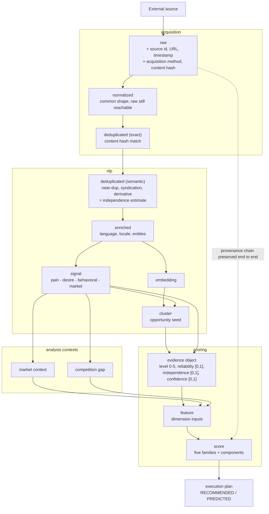
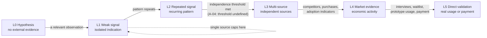
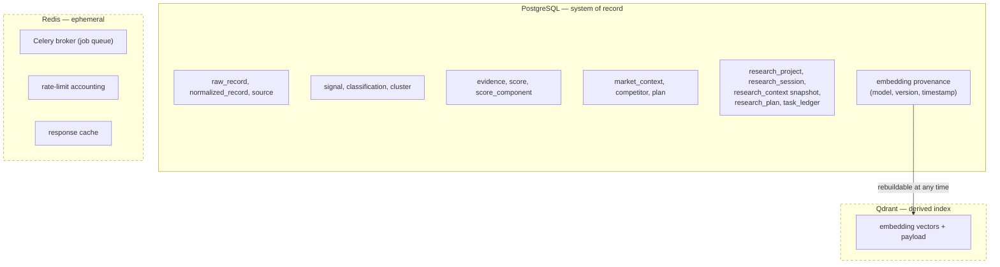

# Data Flow

How a raw record becomes a score, and what must travel with it.

> **Updated in Mission 0.1.1.** `workspace_id` added to the mandatory provenance
> set (ADR-005). Confidence quantities are on the unit interval `[0,1]`
> (`scoring-framework-v1.1.md` §4.1).

---

## 1. Record lifecycle

**Deduplication appears twice on purpose.** Exact dedup needs no semantics and
belongs where records arrive. Near-duplicate, syndication and derivative
detection need semantics and belong in `nlp`. `data-principles.md` §6 requires
both; §6 also forbids destroying provenance while doing either.

---

## 2. What travels with the data

The pipeline above is the easy part. This is the part that is expensive to
retrofit and cheap to build in now.

```mermaid
flowchart LR
    subgraph MUST["Mandatory at every stage"]
        P1["source identifier"]
        P2["URL / reference"]
        P3["collection timestamp"]
        P4["source type"]
        P5["acquisition method"]
        P6["extraction method"]
        P7["content hash"]
        P8["parent / derivative link"]
        P9["workspace_id"]
    end

    subgraph ADDED["Added by nlp"]
        A1["model + version"]
        A2["prompt / template version"]
        A3["parameters"]
        A4["language / locale"]
        A5["independence estimate"]
    end

    subgraph ADDED2["Added by scoring"]
        B1["evidence level 0-5"]
        B2["reliability"]
        B3["recency decay applied"]
        B4["framework version"]
        B5["profile version"]
        B6["evidence snapshot time"]
        B7["claim type (5 values)"]
        B8["confidence [0,1]"]
    end

    MUST --> ADDED --> ADDED2
```

`workspace_id` is part of this mandatory set (ADR-005): a record whose tenant is
unknown cannot be safely served to anyone.

Provenance fields are **NOT NULL by default** (audit A-10). The specifications
qualify provenance with "where technically possible", which is unenforceable as
written: an implementer can always claim infeasibility. Inverting the default
makes an exemption an explicit, reviewed decision instead of an accident.

---

## 3. Evidence level progression

Two gates on this diagram are **not yet specified**:

- **L2 → L3** requires "sufficiently independent" sources. No threshold exists
  (audit A-04). `independence: 0.91` in the spec's example object implies a
  continuous estimate; the level implies a boolean gate. The bridge between them
  is undefined.
- **Recency decay** applies at every level with domain-dependent rates that are
  not parameterized (audit A-03).

Both must be resolved (D-03) before `scoring` is implemented. Implementing
scoring first would mean inventing the thresholds, and an invented threshold
presented as a score is precisely the false precision
`scoring-framework-v1.1.md` §10 forbids. This blocker is now recorded normatively
in `scoring-framework-v1.1.md` §13.

---

## 4. Storage responsibilities

PostgreSQL holds the truth, including the *provenance* of every embedding.
Qdrant holds the vectors, which are a derived index. Redis holds nothing that
cannot be lost.

The practical consequence: Qdrant and Redis need no backup strategy, and a total
loss of either costs a re-index or a re-run, never data. If embeddings were
stored only in Qdrant, that would stop being true and the operational burden
would triple.

---

## 5. Numeric representation across the flow

Resolved in Mission 0.1.1 (`scoring-framework-v1.1.md` §4.1). Four distinct
quantities travel this pipeline and must never be interchanged:

| Quantity | Range | Where it appears |
|----------|-------|------------------|
| `confidence`, `reliability`, `independence`, signal `value` | `[0.0, 1.0]` | Evidence objects, classifications, every derived value |
| `evidence_level` | integer `0–5` | Evidence objects only. Never averaged, never rescaled |
| Dimension scores and the five score families | `0–100` | `scoring` output |
| Claim type | 5-value enum | Every analytical statement |

The dangerous collision is **`Model Confidence`**, which is a *score family* on
0–100, versus the `confidence` *field* on an individual evidence object or score
component, which is on `[0,1]`. Same word, different quantity, different range.
`packages/contracts` declares both with their validators, and the naming rule —
`confidence` is always `[0,1]`, `*_score` is always `0–100` — is what keeps them
apart in code.

## 6. Retention across the flow

`data-retention-policy-v1.md` applies different retention to different stages of
this pipeline:

| Stage | Default retention |
|-------|-------------------|
| `raw` | 30 days |
| `normalized`, `signal`, `evidence` | 12 months maximum target |
| Aggregates, clusters, features | Longer where lawful and non-reconstructive |
| `score` | Versioned historical record, retained |

The consequence for this diagram: **a score outlives the evidence that produced
it.** A score record must therefore stay explicable after its upstream content
has expired, and a dangling evidence reference must render as "evidence expired",
never as an error and never silently as "no evidence".
