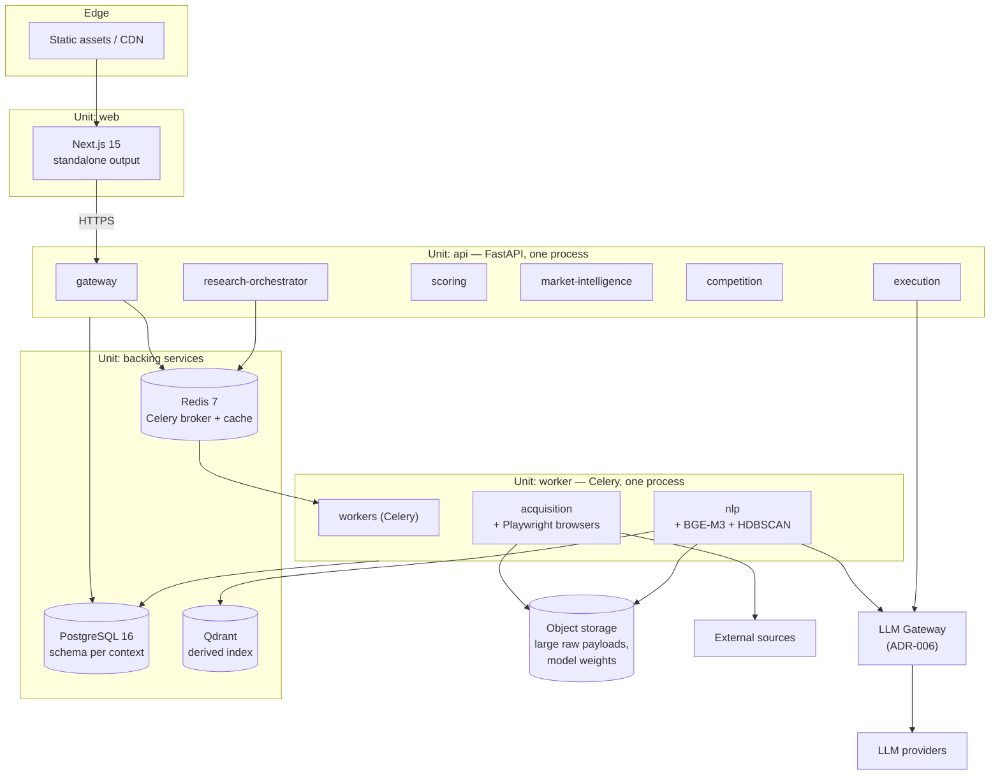
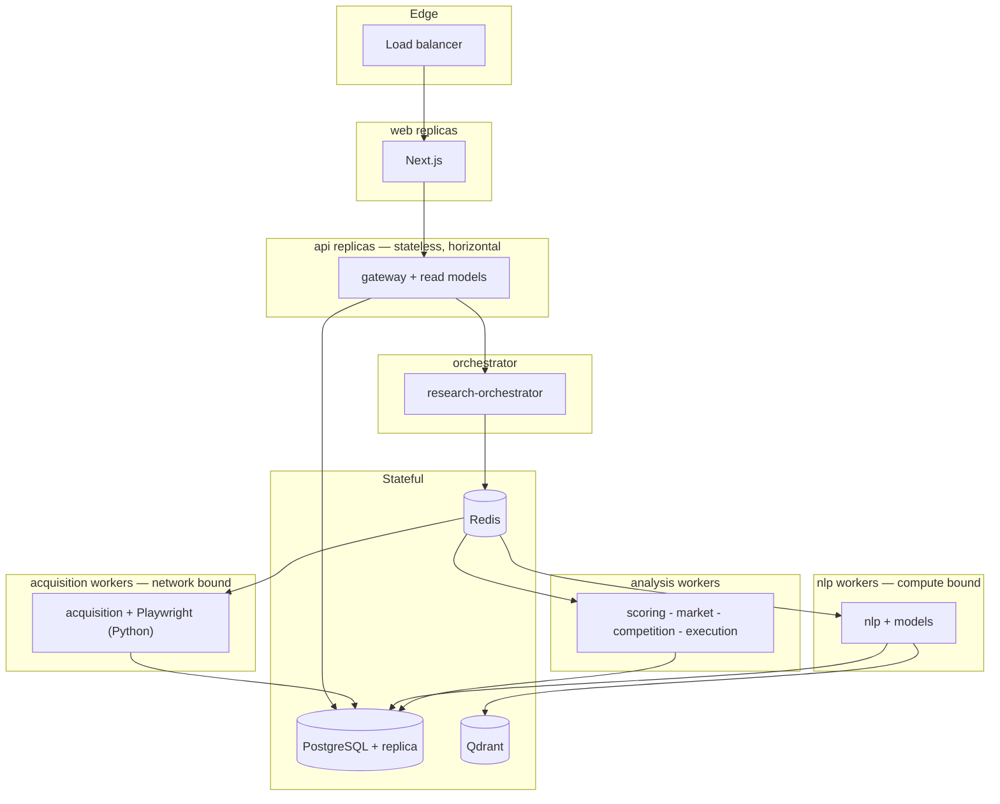
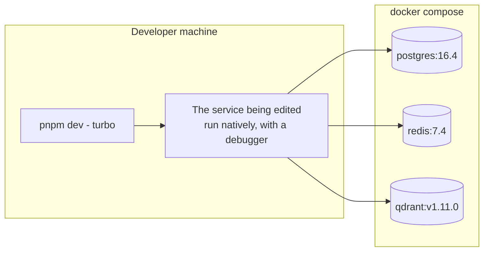

# Deployment View

What actually runs, where. Two phases, and the local development stack.

> **Updated in Mission 0.1.1.** ADR-004 resolved the runtime question: all
> backend contexts are Python, jobs run on Celery over Redis, there is no Node
> worker tier. ADR-007 resolved D-10 for the foundation phase: **local-first with
> Docker Compose**, production deferred to a future ADR.

---

## 1. Phase 1 — foundation

Four deployable units. Nine bounded contexts. That is not a contradiction: the
boundary is the contract, the process count is a deployment choice
(`service-boundaries.md` §2).

### Why this split and not another

| Unit | Grouped because | Scales with |
|------|-----------------|-------------|
| `web` | Pure presentation, separate release cadence | User traffic |
| `api` | Request-serving, low latency, small memory, stateless | User traffic |
| `worker` | Long-running, high memory, large images, tolerant of restarts | Research workload |
| — | `api` and `worker` share one Python codebase; they differ only in entrypoint (ADR-004) | — |
| `backing` | Stateful, operated differently from everything else | Data volume |

The line between `api` and `worker` is the one that matters: **request-serving
and batch compute have incompatible resource profiles.** An `nlp` job loading
BGE-M3 into memory inside the process that serves HTTP requests will cause
latency spikes on unrelated endpoints, and every API restart will drop
in-flight research work.

`acquisition` and `nlp` sit with `workers` in Phase 1 because they are the two
leaves of the call graph — nothing depends on them synchronously, so co-locating
them costs nothing.

---

## 2. Phase 2 — extraction when justified

Extraction is triggered by a **measured** difference in scaling profile, failure
domain, or resource shape. Not by the diagram looking tidier.

### Extraction triggers

| Extract | When |
|---------|------|
| `nlp` | Model memory or CPU contention degrades other work; or GPU becomes necessary |
| `acquisition` | Browser automation instability or long-running fetches affect other job types |
| `gateway` | User traffic and research workload need independently sized capacity |
| Read replica | Read-heavy dashboard queries contend with pipeline writes |
| Broker swap (Redis → RabbitMQ) | Redis broker durability proves insufficient. A Celery configuration change, not a rewrite (ADR-004) |

Each of these is observable before it is acted on. Extracting before the signal
exists is the premature microservice `docs/CLAUDE.md` warns about.

---

## 3. Local development

Backing services in Docker, the service under edit on the host. Forcing every
service into a container makes attaching a debugger painful enough that people
stop using compose at all, which is how a local stack rots.

Target: `docker compose up` to a working environment in under two minutes.

---

## 4. Deployment rules

1. **Pinned versions everywhere.** Never `latest`, in any image, in any
   environment.
2. **Non-root containers.**
3. **Health and readiness endpoints on every service.** Readiness includes
   downstream checks; a service that cannot reach PostgreSQL is not ready, even
   though it is alive.
4. **Secrets injected at runtime**, never baked into an image layer, never in an
   `ARG`.
5. **Migrations run as a separate step**, before the new version starts — not on
   application boot, where two replicas will race.
6. **Model weights are mounted or fetched**, not baked in (`infrastructure/docker`).
7. **Qdrant needs no backup.** It is a derived index and is rebuildable.
   PostgreSQL does need one.
8. **Redis is a broker, not a cache only.** With Celery it holds in-flight job
   state, so AOF persistence and `acks_late` must be configured deliberately —
   including locally, so job-loss behavior is observed in development rather than
   discovered in production (ADR-004, ADR-007).
9. **Portability rules are binding** (ADR-007): configuration from the
   environment, no local filesystem as a system of record, no hard-coded hosts,
   stateless services, no cloud-provider SDK in application code, migrations as a
   discrete step, health and readiness endpoints, pinned versions. These are what
   keep "local-first" from becoming "local-only".

---

## 5. Why production is deliberately undefined

ADR-007 defers the production target rather than guessing it. The trade-off is
explicit and worth restating here, because a deployment diagram with no
production box invites someone to fill it in under pressure:

- **What is gained:** no platform abstractions leak into application code before
  there is load data, operational experience, or a user to serve.
- **What is risked:** the decision gets made implicitly by whoever first needs to
  deploy something, at the worst possible moment.

The mitigation is the eight portability rules, not optimism. A system that
honours them can be deployed to a VPS, a container platform or Kubernetes without
touching application code. A system that violates any of them has already chosen
a target without deciding to.

Local Compose is **not** a production rehearsal: it has no TLS, no resource
limits, no backups, no HA and no secrets management. Some failure classes are
structurally undiscoverable there, and the production ADR will have to address
them from scratch.
