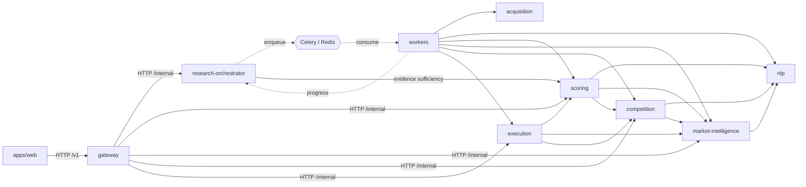
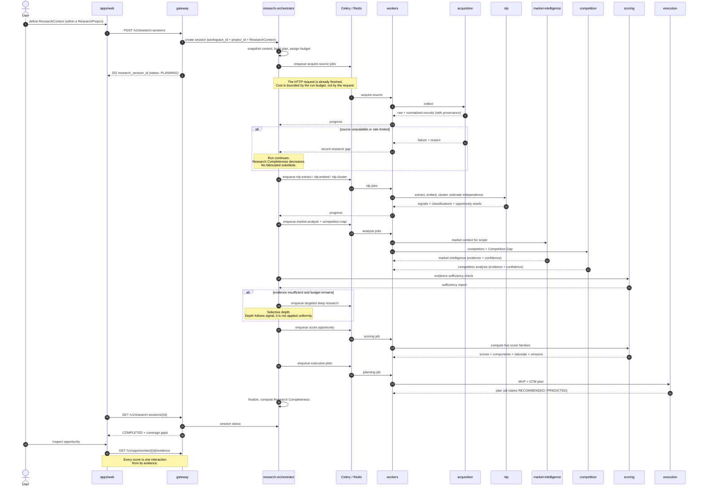

# Service Communication

Two views: the allowed call graph (static), and one `ResearchSession` (dynamic).

> **Updated in Mission 0.1.2.** The persisted execution entity is
> `ResearchSession` (Ontology V2 §11); `research run` is retired. Endpoints and
> correlation fields use the canonical names.
>
> **Updated in Mission 0.1.1.** Queue is Celery over Redis (ADR-004). Every call
> and every task payload carries `workspace_id` (ADR-005).

---

## 1. Allowed call graph

Solid = synchronous call. Dashed = asynchronous message.
Anything not drawn is forbidden (`service-boundaries.md` §4).

### Invariants visible here

- `apps/web` has exactly one outgoing edge.
- `acquisition` and `nlp` have **no outgoing edges** to other contexts.
- Nothing calls `workers`. Work enters through the queue.
- `gateway` has no path to `acquisition`, `nlp` or `workers`.
- The graph is acyclic. `workers -.progress.-> research-orchestrator` is the only
  back edge, and it is events only.

---

## 2. One ResearchSession

### Three things this sequence encodes deliberately

1. **The HTTP request returns before the work starts** (step 6). A synchronous
   session would put an unbounded LLM bill behind a user clicking a button.

2. **A failed source is a recorded gap, not a run failure.** The run continues
   with lower Research Completeness. The alternative — silently continuing as if
   coverage were complete — inflates every downstream confidence value.

3. **Evidence sufficiency is checked before scoring, and can trigger more
   research.** This is the loop that makes `Research Completeness` meaningful:
   something in the system compares intended coverage against actual coverage and
   can act on the difference.

4. **The queue is Celery over Redis, and delivery is at-least-once** (ADR-004).
   Every `Q->>WK` arrow above may fire twice for the same logical work. That is
   not an edge case to handle later: it is the normal contract, and every job
   body must be idempotent for the sequence above to be correct.

5. **`workspace_id` travels the whole sequence.** It enters at the gateway,
   rides in every task payload, and is written on every row produced. No
   participant below the gateway resolves it independently — a worker that could
   look up "the current workspace" could look up the wrong one (ADR-005).

6. **The `ResearchContext` is snapshotted at step 4, not referenced.** Editing the
   project's context afterwards must not retroactively change what this session
   says it ran with. That immutability is the whole reason the snapshot exists
   (Ontology V2 §11.3).

7. **Reaching `COMPLETED` does not mean full coverage.** A session that exhausts
   its budget or loses a source still completes, with recorded gaps and a lower
   Research Completeness. `FAILED` means the research could not run, not that the
   market was empty (Ontology V2 §15).
