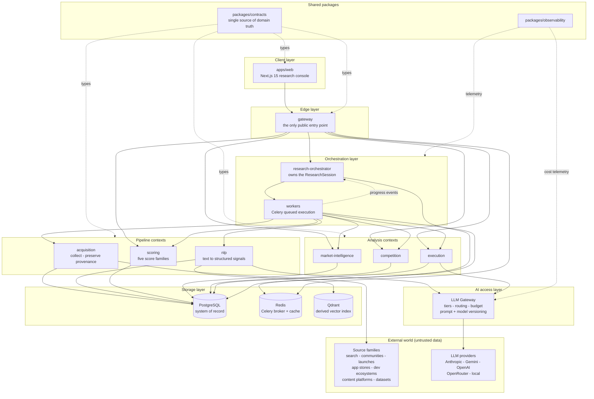

# System Overview

The layered view: what exists and how the layers stack.

> **Updated in Mission 0.1.1.** Queue is Celery over Redis (ADR-004). All backend
> contexts are Python. LLM access goes through the provider-agnostic LLM Gateway
> (ADR-006). Every tenant-scoped flow carries `workspace_id` (ADR-005).

## Reading notes

**The edge is a wall.** `apps/web` reaches exactly one thing: `gateway`. Nothing
in the client layer touches a datastore. This is what makes the API contract the
only thing the frontend can depend on.

**The orchestration layer separates deciding from doing.**
`research-orchestrator` owns the `ResearchSession`: it decides what to research
and enqueues it;
`workers` runs it. The dotted edge back to the orchestrator carries progress
events only. If it ever carries work requests, the graph gains a cycle and the
queue stops being the only scheduling authority.

**`acquisition` and `nlp` are leaves.** They call storage and the outside world,
never another context. That is why they are the first candidates for extraction
into their own processes (`service-boundaries.md` §2).

**`gateway` cannot reach `acquisition`, `nlp` or `workers`.** A user request
cannot synchronously trigger collection or an LLM call. It starts a run; the run
is asynchronous and budgeted. This is the structural reason an HTTP request
cannot spend an unbounded amount of money.

**Qdrant is derived, not primary** (audit A-09). Everything in it can be rebuilt
from PostgreSQL. It needs no backup strategy.

**`packages/contracts` reaches every layer** (dotted). One declaration of every
domain enum. C-02 and C-04 were resolved in the specifications by domain V1.1;
`packages/contracts` is what stops them recurring in code.

**The AI access layer is a chokepoint by design** (ADR-006). `nlp` and
`execution` reach providers only through the LLM Gateway. That single edge is
where budget enforcement, prompt versioning, model-version recording and
structured-output validation happen. Bypassing it would mean re-implementing all
four per call site, which is how they stop being implemented.

**Every tenant-scoped flow carries `workspace_id`** (ADR-005). It is not drawn as
an edge because it travels on every edge: service calls, Celery payloads, cache
keys, Qdrant filters and log lines. The two paths that do not go through SQL —
the Redis cache and the Qdrant index — are the ones where a missing tenant filter
leaks silently.
